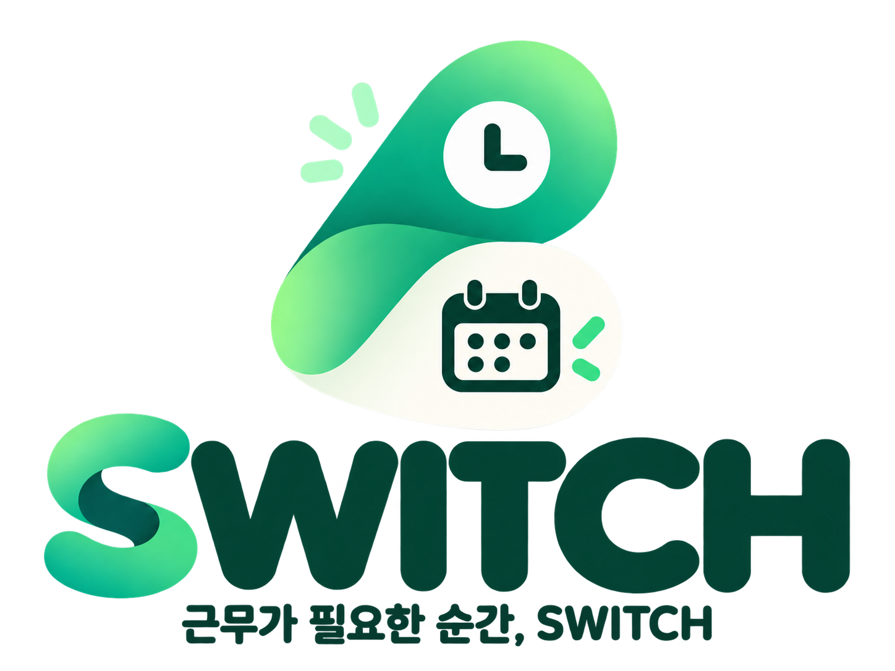
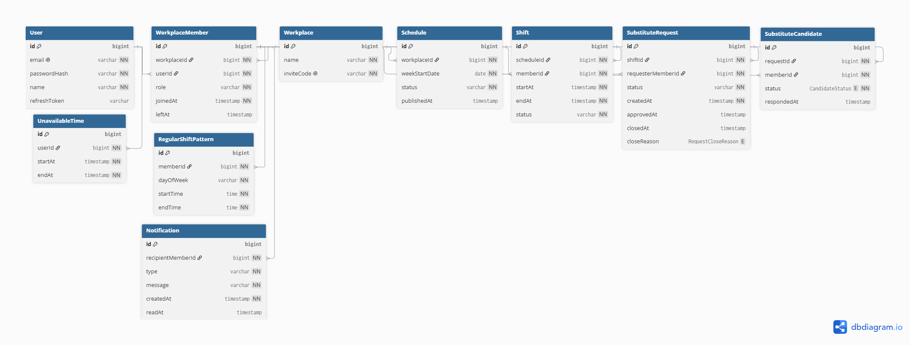
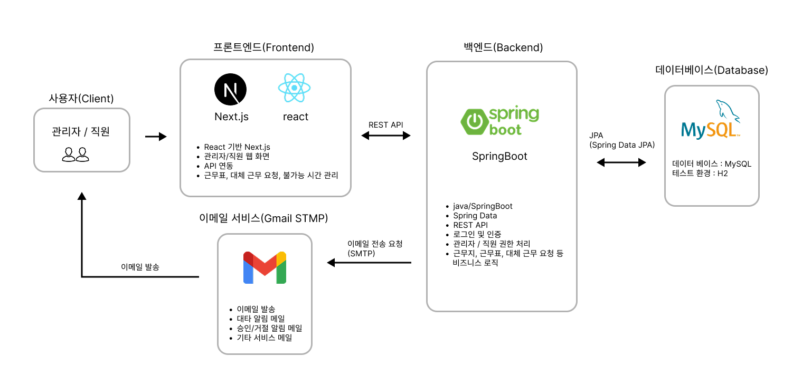
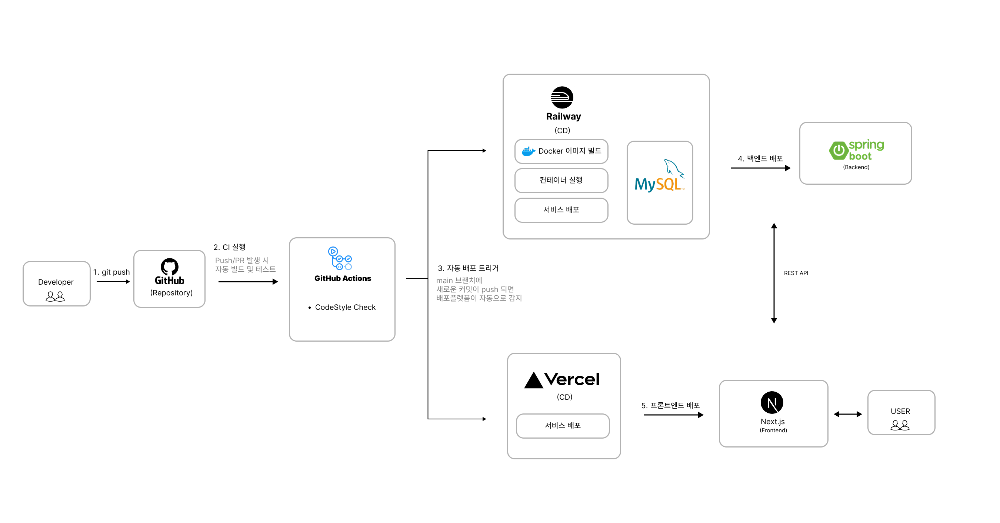

<div align="center">



<br>

### 근무 스케줄과 대체근무 요청을 더 간편하게

소규모 사업장을 위한  
**근무 일정 및 대체근무 관리 서비스**

<br>

**Team Merge · 머지가머지**

<br>

[🌐 SWITCH 바로가기](https://switch-drab.vercel.app/)

</div>

---

## 📌 프로젝트 소개

**SWITCH**는 소규모 카페 및 음식점의 근무 일정과  
대체근무 요청을 한곳에서 관리하기 위한 서비스입니다.

관리자는 정기 근무 패턴을 기반으로 주간 근무표를 생성·공개하고,  
근무자는 자신의 근무 일정을 확인하거나 필요한 경우 대체근무를 요청할 수 있습니다.

기존에 메신저 등을 통해 개별적으로 이루어지던 대체근무 과정을

**요청 → 후보 자동 선별 → 직원 수락 → 관리자 승인 → 공식 근무표 반영**

의 흐름으로 관리하여 근무 일정 변경 과정을 명확하게 관리하는 것을 목표로 합니다.

### 📅 프로젝트 기간

**2026.09.14 ~ 2026.10.01**

---

## ✨ 주요 기능

<details>
<summary><b>주요 기능 보기</b></summary>

<br>

### 👑 관리자

- 근무지 생성 및 직원 조회
- 초대 코드를 통한 근무지 참여
- 정기 근무 패턴 등록 및 관리
- 주간 근무표 생성·수정·공개
- 대체근무 요청 최종 승인
- 승인 완료 후 공식 근무표 반영

### 👤 근무자

- 참여 중인 근무지 조회
- 개인 근무 일정 조회
- 근무 불가능 시간 등록 및 관리
- 대체근무 요청
- 받은 대체근무 요청 조회 및 수락·거절
- 보낸 대체근무 요청 진행 상태 조회

### 🔔 공통

- JWT 기반 회원 인증
- 근무지별 `MANAGER` / `EMPLOYEE` 권한 분리
- 대체근무 상태 기반 흐름 관리
- 근무표 공개 및 대체근무 주요 상태 변경 알림

</details>

---

## 🛠 Tech Stack

### Backend


### Frontend


### Database / DevOps / Deployment


### Collaboration


---

## 💡 기술적 포인트

### 🔐 근무지 단위 권한 관리

사용자는 여러 근무지에 참여할 수 있으며,  
각 근무지마다 `MANAGER` 또는 `EMPLOYEE` 역할을 가질 수 있습니다.

현재 근무지에서의 역할을 기준으로 접근 가능한 API와 화면을 분리하여  
관리자 전용 기능이 직원에게 노출되거나 호출되지 않도록 처리했습니다.

### 🔄 대체근무 후보 자동 선별 및 상태 관리

대체근무 요청 시 같은 근무지의 직원 중  
요청자 본인과 근무 시간이 충돌하는 직원을 제외하여 요청 가능한 후보를 자동으로 선별합니다.

후보 선별 시 공식 근무 일정, 근무 불가능 시간,  
이미 수락한 대체근무와의 시간 충돌을 함께 확인합니다.

후보 선정 이후 일정이 변경될 가능성을 고려하여  
직원이 요청을 수락하는 시점에 충돌 여부를 다시 검증합니다.

### ✅ 트랜잭션을 통한 데이터 정합성 유지

대체근무 수락 과정에서 후보 및 요청의 최신 상태를 다시 확인하고,  
재검증부터 상태 변경까지 하나의 트랜잭션으로 처리합니다.

관리자 승인 전까지는 기존 공식 근무 담당자를 유지하며,  
승인 완료 시에만 실제 근무 담당자를 변경합니다.

### 🔔 커밋 이후 알림 생성

근무표 공개와 대체근무 주요 상태 변경 시 이벤트를 발행하고,  
`@TransactionalEventListener`를 활용하여 원본 작업이 정상적으로 반영된 이후 알림을 생성합니다.

이를 통해 핵심 비즈니스 로직과 알림 처리를 분리했습니다.

### 🔑 JWT 인증 및 토큰 재발급

Access Token을 이용해 API 요청을 인증하며,  
토큰 만료 시 Refresh Token을 통해 Access Token을 재발급합니다.

동시에 여러 API 요청에서 토큰 만료가 발생하더라도  
재발급 요청이 중복되지 않도록 처리했습니다.

또한 로그인·로그아웃 시 변경되는 `sessionVersion`을 기준으로  
재발급 도중 세션이 변경된 경우 이전 세션의 응답이 현재 인증 상태에 반영되지 않도록 처리했습니다.

---

## 🗄 ERD

<p align="center">
  
</p>

---

## 🏗 시스템 아키텍처

<p align="center">
  
</p>

---

## 🔄 CI/CD 및 배포 구조

<p align="center">
  
</p>

---

## 🚀 실행 방법

### 실행 환경

- JDK 25
- Node.js / npm

### Backend

저장소 루트에서 백엔드 디렉터리로 이동합니다.

```bash
cd backend
```

Windows:

```bash
gradlew.bat bootRun
```

macOS / Linux:

```bash
./gradlew bootRun
```

기본 API 주소:

```text
http://localhost:8080/api/v1
```

> 로컬 개발 환경에서는 H2 Database를 사용합니다.

### Frontend

프론트엔드 디렉터리로 이동합니다.

```bash
cd frontend
```

의존성을 설치하고 개발 서버를 실행합니다.

```bash
npm install
npm run dev
```

기본 접속 주소:

```text
http://localhost:3000
```

별도의 백엔드 주소를 사용할 경우  
`frontend/.env.local`에 다음과 같이 설정합니다.

```env
NEXT_PUBLIC_API_URL=http://localhost:8080/api/v1
```

---

## 👥 Team Merge

| 이름 | 역할 | 담당 기능 |
| --- | --- | --- |
| **황희리** | 팀장 | 근무지 관리 · 대체근무 후보 선별·응답 |
| **백혜승** | 서기 | 주간 근무표 관리 · 알림 |
| **김덕우** | 팀원 | 회원·인증 · 대체근무 요청 생성 |
| **박세민** | 팀원 | 정기근무 관리 · 근무 불가 시간 관리 |
| **최세현** | 팀원 | 근무 일정 관리 · 대체근무 승인 |

---

## 🤝 Convention

<details>
<summary><b>개발 컨벤션 보기</b></summary>

<br>

### Branch

```text
feat/기능명
fix/기능명
docs/문서명
```

예시:

```text
feat/workplace
feat/schedule
fix/substitute-request
docs/readme
```

### Commit

| Type | 설명 |
| --- | --- |
| `feat` | 새로운 기능 추가 |
| `fix` | 버그 수정 |
| `test` | 테스트 코드 추가 및 수정 |
| `docs` | 문서 추가 및 수정 |
| `refactor` | 비즈니스 로직 변경 없이 코드 구조 개선 |
| `chore` | 설정, 의존성 등 기타 작업 |

### Code Style

- Google Java Style Guide 기반
- Java 들여쓰기 Space 4칸
- IntelliJ Project Code Style 공유
- 기능별 Branch 개발 후 Pull Request 및 Code Review 진행

</details>

---

<div align="center">

### 근무가 필요한 순간, SWITCH

**Team Merge · 머지가머지**

</div>